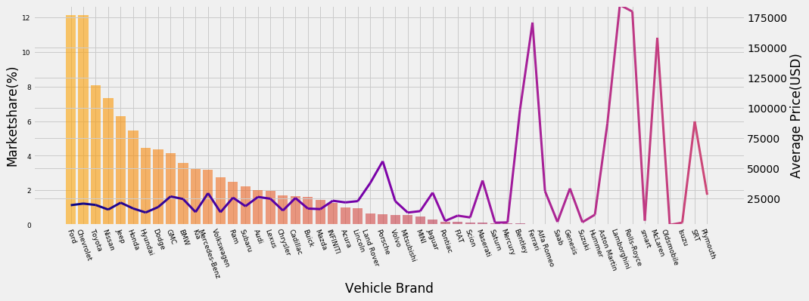
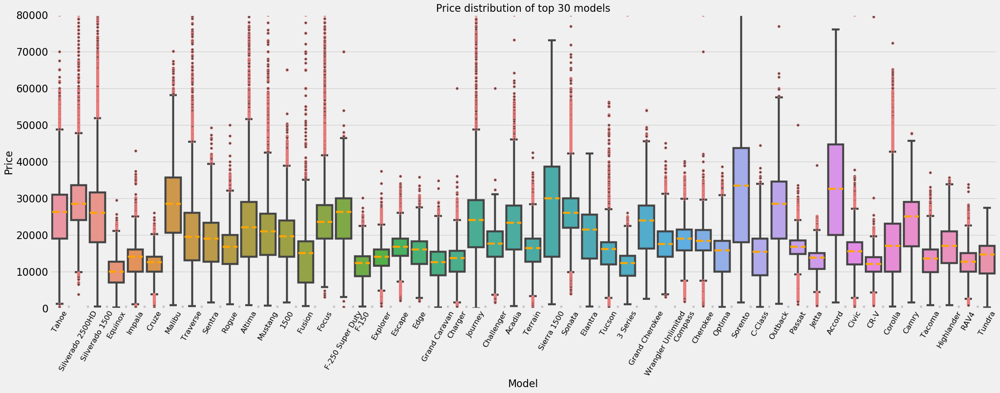
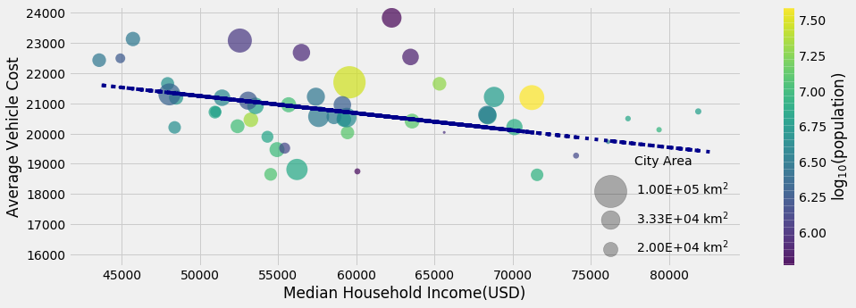
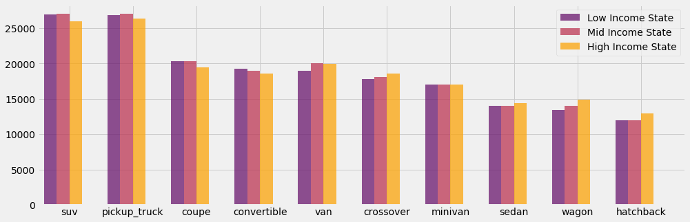
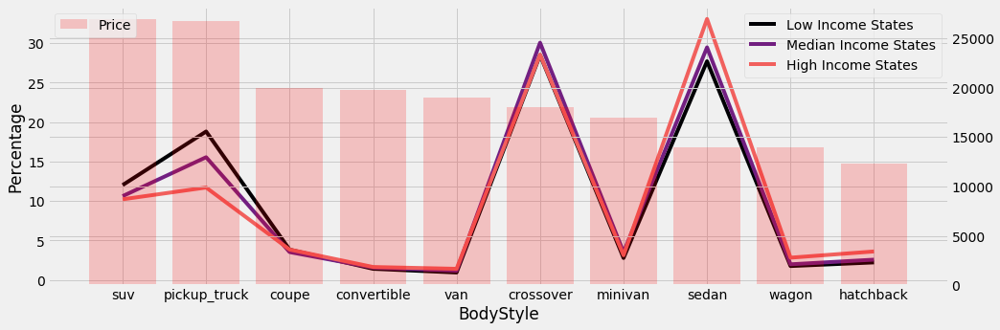
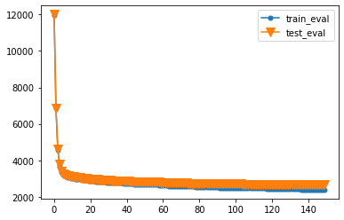
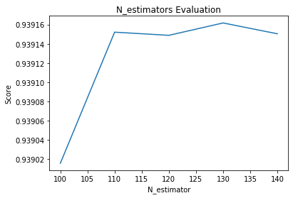

# Used Car Market Data Analysis
### Research Background   
The market sales of used car is more than twice of the size of new car segment and keeps reaching new peak in growth.
Over the past five years, the sales number of used car rised from 35.8 million in 2014 to 40.2 million in 2019.
Demands include inline/offline service, dealership, insurance and information service. The whole businesses keep expanding as we expected.  
What we are considering is the issue of service quality while the market is expanding at the same time.  
Problems of buying a used car sometimes could be serious.  Using advantages of information gap such as concealing defect of product or overestimation of certain product for selling at priority.  
### Introduction  
This side project is to fullfill the two main objectives. One for price prediction for used car given different conditions.
Another is to do classification as recommendation system both for dealership and customer.
Given the point that customer are prepared to make decision after receiving fair information at which utimaltely reduce infromation gap between both sides.
 
We had been searching for any possible dataset provided on the Internet, but those were not valuable enough to take into consideration. Millions of rows but roughly with only four or five columns, or the periods were obsolete.
Then, we realized the qualifications of this sideproject's dataset must be as precise and detailed as possible which means the quantity of the columns. Also the dataset better not be obsolete which means the timeline be in around 2019.    
Finally, we decided to scrap the vehicle selling information posted on the usedcar websites.  
Here is the dataset we got which was made on 12/20/2019.  

| Number of Rows | Number of Columns |
| ------------- | ------------- |
|   2375350 |      25 |  

### Data Description  

Below is the list of columns and its description:
* Title  
Title of vehicle. 
* Make   
Vehicle brand.  
* Price
price of vehicle in USD.  
* Mileage  
One indicator of vehicle condition, a number of miles a vehicle covered.  
* Model  
Vehicle Model.  
* Trim  
A vehicle trim model is a version of a vehicle model used by manufacturers to identify a vehicle's level of equipment.
* BodyStyle  
The body style of a vehicle refers to the shape and model of a particular automobile make.  
* Rental  
Tell if the vehicle is a rental car or not.  
* Location  
State and city/county of a vehicle where it locates.  
* MPG_city  
Fuel efficiency under city driving condition.  
* MPG_highway  
Fuel efficiency under highway driving condition.     
* Transmission  
A transmission is a machine in a power transmission system, which provides controlled application of the power.  
* OwnershipHistory  
Count of previous owners of a car.  
* FuelType  
Type of fuel that is used to provide power to vehicle.  
* Exterior   
Color of exterior part of car.  
* Interior  
Color of interior part of car.  
* DriveType    
The DriveType of a motor vehicle is the group of components that deliver power to the driving wheels.  
* Accident Report  
Inspection of accidents occured on a car.  
* Seating  
Maximum number of seating.  
* VIN  
Vehicle Identification Number. VIN is used to identify a specific vehicle.  
* DoorCount    
Number of doors of car.  
* OptionCount  
Count of options on a car.  
* Engine  
An engine is a machine designed to convert one form of energy into mechanical energy.  
* Features    
Features shows the major packages or equipment that a car uses.  
* Certified  
This column specify if a car is CPO(certified pre-owned). A CPO car comes with a complete inspection that repairs any damaged or worn parts before being offered for sale.  

### Exploratory Data Analysis  

[Data Exploration](Data_Cleaning_and_EDA.ipynb)(Click the link for further detail!) : Explore the dataset and check its distribution at multiple aspects.   
1. Distribution of each brand model marketshare and it's average price.  

2. Detection of top 30 models' price outliers.  

3. Comparison of median income and average vehicle price of each state.  

4. Median price comparison by body style over three grouped states by median income range.  

5. Comparison of each body style by marketshare percentage and average vehicle price by three grouped states. 

### Machine Learning  

[Price Prediction](Usedcar_ML.ipynb)(Click the link for further detail!) : The task of ML is to fit the model to the dataset.
And find the optimal solution to the predication.     
### XGBoost
  
method:gbtree
| R-squared | RMSE |
| ------------- | ------------- |
|   0.937 |      2650 |    
### Random Forest
  
method:regression
| R-squared | RMSE |
| ------------- | ------------- |
|   0.94 |      2618 |

[Product Classification Analysis](Usedcar_Classification.ipynb)(Click the link for further detail!) : The task of KMeans is to classify the most related product for customer or dealer as recommendation.
